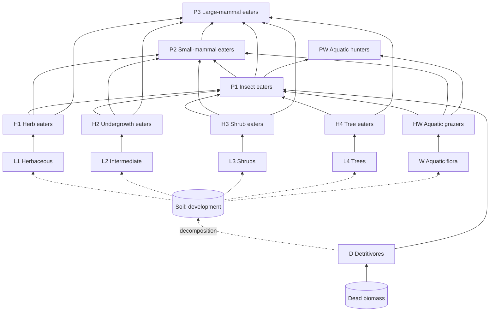

# gamerules.md — Gameplay vision and rules

> Companion to `INSTRUCTIONS.md`. This file defines **what the game is**; `INSTRUCTIONS.md` defines **how it is built**.
> Items tagged **[Proposed]** are design suggestions not yet validated by the author. Treat them as defaults that may change.
> Untagged rules are the author's decisions.
> All numeric values live in `data/balance.toml`; numbers in this file are illustrative only.
> Species data (§5–§6) also exists as machine-readable data in `data/species.toml`: one stat sheet per species (D-029). This file is the design reference.

---

## 1. Core loop

1. Players earn **biomass points**, from the thriving species in their ecosystems, plants + fauna.
2. They spend biomass on one of two things:
   - **unlocking** new species cards in the tech tree;
   - **spawning** species on the map.
3. Spawned species either **defend and grow the economy** (produce biomass, hold territory) or **attack** the opponent (consume enemy biomass), depending on the cell on which they spawn, and on whether their food belongs to the player or the opponent.
4. The ecosystem grows, conquers land, and outcompetes the opponent's ecosystem.

Victory conditions are defined in `INSTRUCTIONS.md` §2.3 (territory share or total biomass at the time limit), refined in §11.

### 1.1 V1 scope

- **Terrain:** a generated map with relief, a river, ponds and rock outcrops (§2.3, D-083); one basic soil type.
- **Start (author's decision, D-095):** the whole map is **bare soil** and nobody owns a cell. Each player starts with a biomass budget; the clock runs from the start, and a player's first planting, anywhere on land, is their **spawn point**: water, relief and rocks around it are a strategic choice. Only lichen & moss is unlocked at start (D-118; grasses cost 200, earthworms 250). Either pioneer can found a colony: lichen & moss spread at about 3/4 the pace of grasses (D-104).
- **Progression:** the landscape emerges through succession, **bare soil → meadow → increasingly developed shrub strata → forest**.
- **Out of V1:** wet meadow and the other biomes (§2.2); pollinators and fire (`INSTRUCTIONS.md` §2.5).
- **V1 species (author's table, D-087):** 15 plants in 5 families and 30 animals in 10 families, three tiers each (small, medium, large). See §4.2 and §5.
  - Every unit has at least one counter, except the apex predators, because of the food web relations.

---

## 2. The world

### 2.1 Hidden grid

- The map is backed by a **hidden grid**. The player **never sees cells**: everything is rendered as a fluid, continuous landscape.
- Each cell has an **owner** (none, player 1 or player 2) and can host several of its owner's species at once, in four vertical strata. Species of the same stratum **complement each other and interpenetrate** (e.g. grasses and wildflowers in one meadow cell), and each keeps spreading (D-022):

| Level | Stratum | Examples (V1) |
|---|---|---|
| L1 | Herbaceous | Lichen & moss, grasses, wildflowers; algae & water lilies |
| L2 | Intermediate (undergrowth) | Ferns, nettles, brambles; reeds |
| L3 | Shrub | Elder, hawthorn, hazel |
| L4 | Canopy (trees) | Oak, chestnut, beech; willow |

Aquatic plants (family W) sit in the stratum of their height: they want the water through their moisture response, so they hold the shallows and wet banks (D-087).

- **[Proposed] Complementarity.** Species of one stratum compete with partial niche overlap (`niche_overlap` in `balance.toml`, below 1), so a mixed stand holds more biomass than a monoculture.
- A cell's **dominant level** is the highest level among the strata present in it, counting only strata whose biomass is above `establish_threshold`.
- **[Proposed] Shade.** Higher strata in a cell reduce the growth of the owner's lower strata in that same cell. Shade-tolerant species suffer less.
- **[Proposed] Succession (soil development).** Each cell has a **soil development** value (organic matter), which starts at 0 on bare soil. Plants raise it over time, pioneers fastest. Each level needs a minimum value to establish: pioneers none, the rest of L1 low, L2 lower-medium, L3 medium, L4 high. This drives the V1 progression bare soil → meadow → shrubs → forest. It is independent of the soil *type* (§2.3).

### 2.2 Biomes [Post-V1]

**Not in V1**: V1 is one flat map on basic soil, where the landscape emerges through succession alone. Later, maps are built from three Western European ecosystems, shaped by the terrain modifiers of §2.3. Each is defined by the underlying water and nutrient fields. A species grows faster in its **affinity biome** and cannot establish where its soil or water requirement is not met.

| Biome | Field signature | Signature flora | Signature fauna |
|---|---|---|---|
| **Temperate deciduous forest** | High nutrients, medium water | Moss, ferns, understory plants, hazel, oak, beech, chestnut | Mycelium, bark beetles, wood mice, roe deer, wild boar, woodpecker, tawny owl, lynx |
| **Wet meadow** | High water, medium nutrients | Sphagnum, sedges & rushes, willow, alder | Slugs & snails, voles, frogs & toads, grey heron |
| **Meadow & bocage** (hedgerow farmland) | Medium water and nutrients; lines of hedgerow cells | Grasses, wildflowers, nettle, bramble, elder, hawthorn & blackthorn, hedgerow oaks | Grasshoppers, pollinators, rabbits, hedgehog, buzzard, weasel, fox |

### 2.3 Terrain modifiers [Placeholder — do NOT implement in V1]

**V1:** one basic soil (loam); soil type and light modifiers equal 1.0.

**Terrain (author's decision, D-083, D-084):** every match has a generated map, the same for both players (180° symmetry):
- **Relief (D-096):** hills, plateaus and winding valleys, with cliffs (rock bands broken by passes) on the steep steps. It shapes moisture: valleys and banks are wet, hills dry. There is no movement penalty.
- **Map types (D-102):** each map draws a type: flat dry plains, meadows with ponds, hills with a river, rocky mountains, a canyon river, lakeland, marsh, or a central lake. The type sets how high and rugged the relief is, how much rock, and the water. Rivers follow the low ground; flooded lowlands make lakes and marshes along the topography.
  - **Shallows:** animals wade across (walkers at half speed). Land plants seep across slowly, through their water response (f_water).
  - **Deep pools** in the river and **deep pond centres:** no land plant grows there, and walkers cannot enter.
- **Rock outcrops** on the high ground: nothing grows there, and walkers cannot enter.
- **Animals** have a medium: walk (land and shallows), swim (water), amphibious (land and water), fly (anywhere). They find their way around what they cannot cross.
- **Territory:** rock and deep water are never owned, so borders stop at them.
- **Homes** are kept dry, flat and rock-free.

**Planned soil types:**

| Soil type | Properties | Favours | Penalises |
|---|---|---|---|
| Basic loam (V1 default) | Reference soil | — | — |
| Sandy | Drains fast, low nutrients, acidic | Lichen, grasses, chestnut | Clover, hazel, beech |
| Clay-limestone | Rich, retains water, alkaline | Beech, hawthorn, hazel, wildflowers | Chestnut (avoids limestone) |

**Planned topography**, from an elevation field:
- **Water:** accumulates in valley bottoms (flow accumulation) and is scarce on ridges and hilltops.
- **Sunlight:** depends on slope orientation. South-facing slopes are sunnier, warmer and drier; north-facing slopes are shadier and cooler.

**Growth model** (to be enabled later):

```
growth_rate(species, cell) = base_rate(species)
                           × f_soil(species, soil_type)
                           × f_water(species, water)
                           × f_light(species, light)
                           × f_development(species, soil_development)
```

Each `f` is a species response curve (an optimum and a tolerance) defined in `data/species.toml` (D-029).

**Hooks to keep from V1 onward** (implemented in the M0 prototype, D-024):
- The simulation already stores the `soil_type`, `elevation`, `water` and `light` fields, with constant values.
- Species data already holds `soil_affinity`, `water_optimum`/`water_tolerance` and `light_optimum`/`light_tolerance`, with neutral defaults.
- Growth code already calls a single modifier function, which returns 1.0 in V1.

Adding terrain later is then new data and a map generator, not a rewrite of the rules.

---

## 3. Plant spread and competition

**Colonization gauge (D-024).** Every species has a gauge (0–100 %) in each cell. It caps the species' capacity there: `capacity = k_max × gauge`. The species is present from the first seeds, and biomass grows toward that capacity. The gauge rises with:
- **neighbourhood:** the cover of the same species, same owner, in the cell and its 4 neighbours;
- **soil:** soil development (a soft ramp up to each level's threshold) and, later, soil type;
- **bioclimate:** water and light, later from terrain.

It rises toward the site's **suitability**, so poor sites fill slower and cap lower. A species whose biomass dies out loses its gauge.

Plants reproduce and spread **from cell to cell**, into the 4 neighbouring cells. For each own cell whose species has enough biomass to spread (above `spread_threshold`), each neighbour is evaluated as follows:

| Neighbour cell state | Result |
|---|---|
| **Empty** | Gradually colonized. A claim progress builds up at `spread_rate × neighbour pressure × suitability`, and the cell switches to the spreading player when progress is complete. The arriving species start established, with a gauge equal to pressure × suitability. Species with zero suitability cannot arrive |
| **Owned by the opponent, same dominant level** | **Nothing happens.** The frontier holds |
| **Owned by the opponent, lower dominant level** (e.g. enemy meadow grasses next to our trees) | Gradually **colonized and smothered**. The enemy biomass decreases at `smother_rate`, our colonization progress rises, and the cell switches to us when the enemy biomass reaches zero |
| **Owned by the opponent, higher dominant level** | Our spread has no effect. Their spread smothers us instead |
| **Owned by us** (D-024) | Each of our species colonizes the neighbour through its gauge: forest advances over our own meadow, and lower strata fill in underneath (understory), subject to shade, soil and bioclimate. Only species established in a neighbour (above `establish_threshold`) seed new arrivals |

Only the **level** is compared, not the tier within a level (see open questions).

**[Proposed] Contested empty cell.** When both players are colonizing the same empty cell, the first to complete progress takes it. If both complete on the same tick, the higher level wins. If the levels are equal too, the cell stays empty.

**Determinism note.** Spread is computed from the previous tick's state (double buffering), so the result never depends on the order in which cells are updated.

### 3.1 Design consequences

- **Same-level frontiers freeze.** There are three ways to break one:
  1. Unlock and plant a **higher level**.
  2. Send **herbivores** to eat the enemy's dominant stratum at the frontier. Its dominant level drops, and your spread takes over.
  3. **[Proposed]** Improve your soil so that a higher level can establish on your side of the frontier.
- **Trees dominate but are slow and demanding.** Their counterplay is fauna that attacks trees: caterpillars defoliate them, and voles eat their seeds (§6.1).
- Frozen frontiers are also broken by the endgame mechanics of §11.

### 3.2 Territory demarcation line

A continuous **demarcation line** is drawn wherever cell ownership changes, so that control of space is always readable.

- **Look:** organic, never jagged along cell edges. It is extracted as a contour (marching squares) from a smoothed ownership field, drawn in player colours with a soft glow.
- **States:**

| State | Display |
|---|---|
| Stable frontier (same level, frozen) | Solid line |
| Active front (colonization or smothering in progress) | Pulsing line, with the pressure direction shown (e.g. flowing particles toward the losing side) |
| Border with empty (neutral) land | Thinner, dashed line |

- The same line appears on the **minimap**. The HUD shows each player's **territory %** and the current victory threshold (§11.3).
- **[Proposed]** A toggle key (`T`) shows or hides the line; it is on by default.
- The line is computed by the **renderer** from snapshots. It is not part of the simulation state, which keeps determinism.

---

## 4. Tech tree

### 4.1 Principles

- The tree goes from the **simplest species to the most complex**, with **flora and fauna in the same tree**.
- The tree is organised in **families** (D-087): 5 plant families and 10 animal families, each with three **tiers** (small, medium, large), one species per tier. Unlocking a card costs biomass.
- Unlocking a card does **not** place anything on the map. It only makes the species available to spawn.
- Unlocks are permanent: a card stays unlocked even if the species dies out on the player's side.
- **Unlock requirements:** the previous tier of the same family, plus, for an animal, one of its habitat plants. For example, the wolf needs the lynx and a tree.
- **Spawning** additionally requires the species' **spawn conditions** (§6.3) to be met at that moment.

### 4.2 Families and tiers (author's table, D-087)

| Family | Small (tier 1) | Medium (tier 2) | Large (tier 3) |
|---|---|---|---|
| **L1** Herbaceous | Lichens & mosses | Grasses | Wildflowers |
| **L2** Intermediate | Ferns | Nettles | Brambles |
| **L3** Shrubs | Elder | Hawthorn | Hazel |
| **L4** Trees | Oak | Chestnut | Beech |
| **W** Aquatic flora | Algae & water lilies | Reeds | Willow |
| **D** Recyclers | Earthworms | Fungi (mycelium) | Black woodpecker |
| **H1** Herbaceous eaters | Grasshoppers | Rabbit | European bison |
| **H2** Intermediate eaters | Slugs & snails | Bank vole | Roe deer |
| **H3** Shrub eaters | Caterpillars | Red squirrel | Red deer |
| **H4** Tree eaters | Bark beetles | Eurasian beaver | Wild boar |
| **HW** Aquatic grazers | Larvae (become dragonflies) | Roach (fish) | Mallard duck |
| **P1** Insect eaters | Great tit | Common frog | Badger |
| **P2** Small-mammal eaters | Kestrel | Pine marten | Red fox |
| **P3** Large-mammal eaters | Eurasian lynx | Wolf | Brown bear |
| **PW** Aquatic hunters | Pike | Grey heron | Eurasian otter |

### 4.3 Diets, habitats and media [Proposed defaults, D-087]

- **Diets (D-122, D-123):** each animal has a primary and a secondary food, and a tier 3 animal a tertiary one, listed in that order in `data/species.toml`. Grazer families feed on their own plant layer first (H1 meadow, H2 undergrowth, H3 shrubs, H4 canopy, HW water), then a neighbouring one; hunter families target an animal size (P1 insects, P2 small mammals, P3 large game, PW water life). Every plant and every animal is food for someone. Recyclers eat dead biomass.
- **Food ranks (D-123):** an animal seeks its primary food in sight first, then the secondary, then the tertiary (an attack-move looks on enemy land the same way). A grazer eats the best-ranked plant in its cell, a hunter the best-ranked prey in reach. A meal gives energy × `[fauna] diet_yield` of its rank: 100 %, 75 %, 50 %.
- **Habitats:** grazers need their food plants on their owner's land; hunters need a plant family (woods for the lynx, water plants for the pike).
- **Media (D-084):** fish and larvae swim; frog, beaver, otter, mallard and heron are amphibious; great tit, kestrel and black woodpecker fly; the rest walk.
- **Black woodpecker (D-092):** will speed up the decay of dead trees; the rule comes later, today it recycles litter like the others.
- **Swarms (D-065):** earthworms, fungi, grasshoppers, slugs & snails, caterpillars, bark beetles and larvae are drawn as swarms, not units.
- **Movement (author's direction, D-088):** insects keep a Brownian flutter; small herbivores are calm and slow and graze stop-and-go; large herbivores move slowly and steadily; hunters are fast when they hunt and calm when idle; birds drift lightly.

### 4.4 Costs [Proposed]

- Every species has its own stat sheet in `data/species.toml` (D-029): **growth** (plants: colonization gauge speed; animals: seconds between births), **spawn cost**, **unlock cost**, **yield** (points per second per covered cell or per animal; stat-sheet seconds are ecology seconds, which run at `pace` per real second, D-069), **population cap** (plants: a share of the map's cells per player, D-045, which limits planting and expansion into free land, not conquest: flipping enemy cells or retaking land grazed bare from the enemy, D-113; animals: a head count per player) and a **special effect**.
- Unlocking is per species: it needs one unlocked species on the previous tier of its family and, for an animal, one of its habitat plants. Species with unlock cost 0 are available at start.
- The initial unlock costs follow the placeholder rule `base(level) × 1.5^(tier−1)`; spawn costs scale with level and body size.
- Higher tiers are not strictly better. They trade off speed vs. efficiency, or shade tolerance vs. growth rate.

---

## 5. Food web design (Western European ecosystems)

### 5.1 Flora and 5.2 Fauna

The species, their stats, diets, habitats and media are in `data/species.toml` (D-029, D-087), one stat sheet each; §4.2 and §4.3 give the design. The stats are placeholders for the balance runs (M7).

### 5.3 Food web overview (trophic groups)

Arrows show energy flow (food → consumer). Dotted arrows are support interactions.



All dead organisms, plants and animals, feed `Dead biomass`.

---

## 6. Fauna rules

### 6.1 Feeding on cells (herbivores)

- Animals attack by **feeding on cells**, and **only where species matching their diet are present**. For example, caterpillars can only feed on cells holding shrubs or trees.
- A feeding herbivore reduces the biomass of the matching enemy stratum in its cell. When a stratum reaches zero it disappears, which can lower the cell's dominant level (§3.1) or empty the cell.
- **Grazed bare (author's decision, D-098):** a cell whose plants are all eaten by the enemy's grazers turns neutral, and its former owner may not take it back for `lockout_s` (30 s): the raider's plants can move in behind its grazers, so fronts move.
- **[Proposed] Seed eaters** (voles, when feeding on hazel or trees) do not reduce standing biomass. Instead, they reduce the enemy tree or shrub's **spread rate** around them.

### 6.2 Feeding on agents (predators)

- Predators attack enemy agents whose species is in their diet. Damage reduces health, and a killed agent becomes dead biomass.
- Predators cannot attack species outside their diet. A fox ignores slugs, for example.
- **Refuge (D-023):** a player's small fauna inside own cells with dense hawthorn & blackthorn or bramble cannot be hunted. Predators are otherwise kept in check by their own predators (§5.2).

### 6.3 Spawn conditions

A species can be spawned only when **all** of the following hold:
1. Its card is unlocked (§4).
2. Its **habitat** exists on the spawning player's side (§5.2, "Habitat (own)").
3. Its **spawn trigger** is met (§5.2, "Spawn trigger"):
   - **Predators are placed with the cursor directly on the cell of interest** (author's rule). Positioning is the core skill here: you drop the predator where its prey is. The target cell must contain enemy prey matching the predator's diet, or be within `r_prey` cells of it. Example: **a fox dropped on the patch where enemy voles or rabbits are feeding on your plants.**
   - **Cost (author's rule, D-061):** an animal landing on own territory costs the base price. Landing on neutral or enemy territory costs ×`drop_surcharge` (1.5): an offensive raid. This applies to every role.
   - **Herbivores (author's rule, D-061):**
     - Called on own land: no trigger. They land on the own habitat cell nearest the click, at base price, to build biomass. They graze own plants at a much reduced bite (`own_graze`), yield biomass passively, and breed. They do not go looking for enemy cells: they move, feed and breed where their food is best.
     - Clicked on enemy or neutral ground: they are **dropped** on the food of their diet nearest the click (within `drop_radius` cells), at ×1.5. Example: caterpillars dropped on an enemy oak or nettle patch.
   - **Predators:** dropped on the huntable enemy prey nearest the click, within `drop_radius` cells (`r_prey`).
   - **Recyclers** (decomposers; the data keeps `role = "decomposer"`, D-092): no trigger, habitat only.
- **[Proposed] UI.** Unavailable cards are greyed out, with the reason shown (e.g. "No enemy prey in your territory").
- **[Proposed] Spawn location (non-predators).** Other fauna spawns on the own cell closest to the clicked point that satisfies its habitat. This replaces "fauna spawns from trees" in `INSTRUCTIONS.md` §2.4, so that early fauna is possible before trees exist.

### 6.4 Energy, upkeep and reproduction

- **Reproduction (D-023):** an animal whose energy crosses a threshold reproduces, which costs energy, under a per-player population cap. Players still spawn cards. The numbers below are [Proposed].
- **Carrying capacity (author's decision, D-066):** a birth also needs food nearby. Within the animal's sight, the food must cover every animal of the same role with an overlapping diet, plus the newborn:
  - grazers and decomposers: `food_reserve` seconds of bites each, from their diet plants (any land) or the litter, shared with the other player's animals that eat the same;
  - predators: `prey_per_predator` huntable enemy prey each, counted over their owner's predators.
  - The per-player and per-species caps stay only as safety ceilings. Populations then rise and fall with their food: prey with the plants, predators with the prey, in the manner of Lotka–Volterra cycles.
- **Hunting (D-066):** a hungry predator (below full energy; a sated one does not hunt) with huntable prey within `strike_radius` cells kills one per flora tick with chance `catch_chance`.
- **Grazing at home (D-066):** herbivores bite their owner's plants at `own_graze` of a full bite, but gain the energy of a full bite, so they live and breed at home without eating their owner's economy.
- Every animal has an energy value. It regains energy by eating and loses it over time. At zero energy it dies and becomes dead biomass.
- **Trophic transfer:** eating converts ~10 % of the consumed biomass into the eater's energy, and ~10 % into biomass points for its owner. This follows the ecological 10 % rule and keeps consumer armies expensive.

---

## 7. Biomass economy

- **Biomass points** are the single currency.
- **Income:** mainly from living plants & fauna growth, in proportion to their biomass and growth. 
- **Spending:** unlocking cards (§4) or spawning species (§8).
- **Prototype rules (D-027, D-029, values [Proposed]):** income = Σ species yield × (cover of each own cell, or number of own animals). Costs are per species (§4.4). Predators dropped outside own land cost ×`drop_surcharge`.

---

## 8. Spawning

- **Flora** is seeded into an area (a brush or circle) on own territory or on its border. It then spreads according to §3.
- **Trees** are placed individually and act as territory anchors.
- **Fauna** spawns according to §6.3, as one or several individuals depending on the species (e.g. a swarm of caterpillars vs. a single fox).

---

## 9. Units and control

### 9.1 Autonomous agents, RTS control

- Fauna units are **autonomous agents**. Without orders they forage within their diet, flee their predators and follow their species' behaviour.
- The player can **select** them, individually or as a group, and give **RTS orders** that override their autonomy until the order is completed.
- Plants are not directly controllable. The player shapes them through seeding and spatial choices.

### 9.2 Default controls

| Input | Action |
|---|---|
| Left click / drag | Select unit(s) |
| Right click on ground | Move to location |
| Right click on enemy target (valid for the unit's diet) | Attack / feed on target |
| `A` + left click | Attack-move: move and feed on any valid target on the way |
| `S` | Stop, return to autonomous behaviour |
| `Ctrl` or `Shift` + number / number | Assign / recall control group (in the browser, Chrome keeps `Ctrl` + 1–8 for its tabs; D-053) |

---

## 10. Offense and defense — the key gameplay tension

| Posture | What it does | Examples |
|---|---|---|
| **Defensive / economic** | Generates biomass, holds and grows territory, protects its own ecosystem | Plants producing biomass; predators spawned to eat enemy herbivores in your territory; earthworms raising soil development |
| **Offensive** | Enters enemy territory to destroy their biomass and weaken their economy | Caterpillars eating enemy plants; rabbits and caterpillars breaking an enemy shrub frontier; predators ordered to hunt enemy prey in enemy territory |

- The core decision at every moment: **invest in growth (defense and economy) or strike the opponent (offense)**.
- Predators are **dropped with the cursor where their prey is**: in your territory to defend, or in enemy territory to raid. Once on the map they can be ordered anywhere.
- **[Proposed] Stance per consumer:** Offensive (seek targets in enemy territory) or Guard (stay on own territory and intercept intruders).
- **Friendly fire:** herbivores without orders may graze your own plants if no enemy flora is nearby, but with a way slower rate, and they generate bonus biomass, the idea is to use them as economy.

---

## 11. Game phases, endgame and anti-stalemate

### 11.1 Phases (V1; written for 20 minutes, the match now lasts up to 60, D-094)

| Phase | Time (indicative) | Dominant layer | What matters |
|---|---|---|---|
| **Early** | 0–5 min | Pioneers, grasses | Race for empty land, soil development, first income |
| **Mid** | 5–12 min | Shrubs, first fauna | Frontiers form; herbivore raids and predator drops decide local fights |
| **Late** | 12–20 min | Forest | L3 frontiers tend to freeze; forest dynamics, pests and disturbances decide the match |

### 11.2 Why stalemates happen

- By the author's rule, same-level frontiers freeze. Once both sides reach forest, the whole frontier can become L3 vs L3 and stop moving.
- A leading player could also turtle and wait for the time limit.

The mechanics below make sure **no position is permanently locked**, and that **the trailing player always has tools to swing the game**.

### 11.3 Anti-stalemate mechanics

1. **Forest gap dynamics (senescence).** Each tree cell has an age. Past maturity, it has a growing chance per tick (seeded RNG) to fall, as windthrow or old age. The tree stratum becomes dead biomass, the cell's dominant level drops, and a **gap** opens. Gaps on the frontier are contestable: whoever recolonizes first takes the cell. Forests stay alive, as real forests do.
2. **Monoculture vulnerability.** Pests (caterpillars, and the bark beetle outbreak card) deal extra damage in cells whose neighbourhood is dominated by a single species. Mixed stands get a resilience bonus. This punishes "walls of beech" and rewards diversity.
3. **Keystone disturbance cards (top of the tech tree).** They are expensive, have a long cooldown, and are **telegraphed**: the opponent sees a warning a few seconds before they hit.
   - *Bark beetle outbreak:* targeted area; the trees there are weakened and lose biomass over time.
   - *Storm:* windthrow along a corridor, opening a line of gaps through a forest.
   - *Forest fire* **[Post-V1]**: ignites a target area. Each tick, fire spreads to neighbouring cells with a chance (seeded RNG) that grows with the cell's biomass. Burnt strata become dead biomass and the soil gains nutrients. Fire dies out on bare or low-biomass cells, so meadow strips act as firebreaks. It opens irregular gaps through a forest.
4. **Decaying territory threshold.** The territorial victory threshold starts high (e.g. 75 %) and decreases linearly to ~55 % at the time limit. This rewards late aggression. If validated, it supersedes the fixed threshold (90 %, D-094) in `INSTRUCTIONS.md` §2.3.
5. **Guaranteed end.** At the time limit, the highest standing biomass (living flora + fauna) wins; if tied, the higher territory share wins; if still tied, the match is a draw.

### 11.4 Comeback levers for the trailing player

- **Asymmetric raids:** herbivores cost much less than the biomass they can destroy. For example, a caterpillar swarm is cheaper than the oak cells it can defoliate.
- **Predator drops:** a well-placed predator can wipe out an enemy raid instantly.
- **Disturbance cards:** they target the leader's biggest asset, the forest.
- **Fast pioneers:** gaps and bare cells can be retaken quickly with cheap species.

### 11.5 Stalemate metric (balancing)

`tools/balance` tracks **frontier mobility**: the territory changing hands per minute. Target: fewer than 5 % of simulated matches reach the time limit with under 2 % territory change over the last 5 minutes.

---

## 12. Open questions

1. **Tier in spread:** should the tier matter within a level? For example, beech beating oak at a same-level frontier.
2. **Contested empty cells:** is the proposed resolution acceptable (§3)?
3. **Predator drops in enemy territory:** allowed with a surcharge, or own territory only?
4. **Herbivore trigger range `R`:** a global rule, or per species?
5. **Stance:** fixed role per species, or a switchable stance per consumer?
6. **Starting conditions:** starting budget and starting unlocks (default proposed in §1.1).

Resolved (see `memory/DECISIONS.md` D-017, D-022): three flora levels, with pioneers as L1 tier 1; bees and fire are post-V1; the hedgehog counters slugs; decomposers are agents; unlocks are permanent; species of one stratum interpenetrate.
