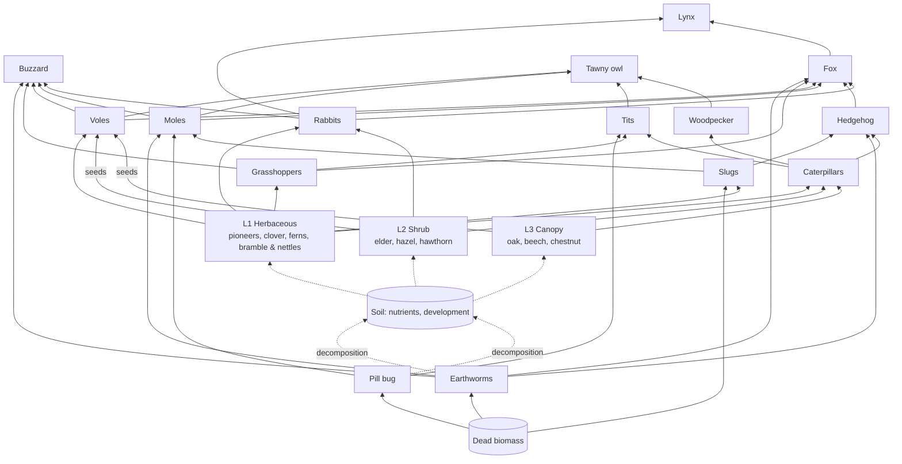

# gamerules.md — Gameplay vision and rules

> Companion to `INSTRUCTIONS.md`. This file defines **what the game is**; `INSTRUCTIONS.md` defines **how it is built**.
> Items tagged **[Proposed]** are design suggestions not yet validated by the author. Treat them as defaults that may change.
> Untagged rules are the author's decisions.
> All numeric values live in `data/balance.toml`; numbers in this file are illustrative only.
> Species data (§5–§6) also exists as machine-readable data in `data/balance.toml`, under `[flora.<id>]` (and later `[fauna.<id>]`) (D-020). This file is the design reference.

---

## 1. Core loop

1. Players earn **biomass points**, from the thriving species in their ecosystems, plants + fauna.
2. They spend biomass on one of two things:
   - **unlocking** new species cards in the tech tree;
   - **spawning** species on the map.
3. Spawned species either **defend and grow the economy** (produce biomass, hold territory) or **attack** the opponent (consume enemy biomass), depending on the cell on which they spawn, and on whether their food belongs to the player or the opponent.
4. The ecosystem grows, conquers land, and outcompetes the opponent's ecosystem.

Victory conditions are defined in `INSTRUCTIONS.md` §2.3 (territory share or total biomass at the time limit), refined in §11.

### 1.1 V1 scope

- **Terrain:** flat, one basic soil type. Soil types and topography are planned but not implemented (§2.3).
- **Start:** the whole map is **bare soil**. **[Proposed]** Each player starts with a starting biomass budget, and chooses where to spawn the first organisms. **[Proposed]** L1 tier 1 (the pioneers) and F1 tier 1 (earthworms) are unlocked at start; the budget covers about one more unlock plus a few seedings; the map is mirrored and each player seeds only in their own half during the first minute.
- **Progression:** the landscape emerges through succession, **bare soil → meadow → increasingly developed shrub strata → forest**.
- **Out of V1:** wet meadow and the other biomes (§2.2); pollinators and fire (`INSTRUCTIONS.md` §2.5).
- **[Proposed] V1 species subset:**
  - Flora (12): L1 herbaceous: pioneers (lichen, moss, grasses), then clover & wildflowers, ferns, bramble & nettles. L2 shrubs: elder, hazel, hawthorn & blackthorn. L3 trees: oak, beech, chestnut.
  - Fauna (15): First group: earthworms, pill bug, slugs. Second group: grasshoppers, caterpillars & butterflies. Third group: voles, moles & hedgehog, rabbits. Fourth group: tits, woodpecker, buzzard. Fifth group: fox, tawny owl, Eurasian lynx.
  - Every unit in the subset has at least one counter in the subset, except the apex predators, because of the food web relations.


---

## 2. The world

### 2.1 Hidden grid

- The map is backed by a **hidden grid**. The player **never sees cells**: everything is rendered as a fluid, continuous landscape.
- Each cell has an **owner** (none, player 1 or player 2) and can host several of its owner's species at once, in three vertical strata. Species of the same stratum **complement each other and interpenetrate** (e.g. grasses and clover in one meadow cell), and each keeps spreading (D-022):

| Level | Stratum | Examples (V1) |
|---|---|---|
| L1 | Herbaceous (pioneers are its first tier) | Lichen, moss, grasses; clover & wildflowers, ferns, bramble & nettles |
| L2 | Shrub | Elder, hazel, hawthorn & blackthorn |
| L3 | Canopy (trees) | Oak, beech, chestnut |

- **[Proposed] Complementarity.** Species of one stratum compete with partial niche overlap (`niche_overlap` in `balance.toml`, below 1), so a mixed stand holds more biomass than a monoculture.
- A cell's **dominant level** is the highest level among the strata present in it, counting only strata whose biomass is above `establish_threshold`.
- **[Proposed] Shade.** Higher strata in a cell reduce the growth of the owner's lower strata in that same cell. Shade-tolerant species suffer less.
- **[Proposed] Succession (soil development).** Each cell has a **soil development** value (organic matter), which starts at 0 on bare soil. Plants raise it over time, pioneers fastest. Each level needs a minimum value to establish: L1 pioneers none, the rest of L1 low, L2 medium, L3 high. This drives the V1 progression bare soil → meadow → shrubs → forest. It is independent of the soil *type* (§2.3).

### 2.2 Biomes [Post-V1]

**Not in V1**: V1 is one flat map on basic soil, where the landscape emerges through succession alone. Later, maps are built from three Western European ecosystems, shaped by the terrain modifiers of §2.3. Each is defined by the underlying water and nutrient fields. A species grows faster in its **affinity biome** and cannot establish where its soil or water requirement is not met.

| Biome | Field signature | Signature flora | Signature fauna |
|---|---|---|---|
| **Temperate deciduous forest** | High nutrients, medium water | Moss, ferns, understory plants, hazel, oak, beech, chestnut | Mycelium, bark beetles, wood mice, roe deer, wild boar, woodpecker, tawny owl, lynx |
| **Wet meadow** | High water, medium nutrients | Sphagnum, sedges & rushes, willow, alder | Slugs & snails, voles, frogs & toads, grey heron |
| **Meadow & bocage** (hedgerow farmland) | Medium water and nutrients; lines of hedgerow cells | Grasses, clover & wildflowers, bramble, elder, hawthorn & blackthorn, hedgerow oaks | Grasshoppers, pollinators, rabbits, hedgehog, buzzard, weasel, fox |

### 2.3 Terrain modifiers [Placeholder — do NOT implement in V1]

**V1:** flat terrain and one basic soil (loam). All modifiers equal 1.0.

**Planned soil types:**

| Soil type | Properties | Favours | Penalises |
|---|---|---|---|
| Basic loam (V1 default) | Reference soil | — | — |
| Sandy | Drains fast, low nutrients, acidic | Lichen, grasses, chestnut | Clover, hazel, beech |
| Clay-limestone | Rich, retains water, alkaline | Beech, hawthorn, hazel, clover | Chestnut (avoids limestone) |

**Planned topography**, from an elevation field:
- **Water:** accumulates in valley bottoms (flow accumulation) and is scarce on ridges and hilltops.
- **Sunlight:** depends on slope orientation. South-facing slopes are sunnier, warmer and drier; north-facing slopes are shadier and cooler.

**Growth model** (to be enabled later):

```
growth_rate(species, cell) = base_rate(species)
                           × f_soil(species, soil_type)
                           × f_water(species, water)
                           × f_light(species, light)
                           × f_development(species, soil_development)
```

Each `f` is a species response curve (an optimum and a tolerance) defined in `data/balance.toml` (D-020).

**Hooks to keep from V1 onward** (implemented in the M0 prototype, D-024):
- The simulation already stores the `soil_type`, `elevation`, `water` and `light` fields, with constant values.
- Species data already holds `soil_affinity`, `water_optimum`/`water_tolerance` and `light_optimum`/`light_tolerance`, with neutral defaults.
- Growth code already calls a single modifier function, which returns 1.0 in V1.

Adding terrain later is then new data and a map generator, not a rewrite of the rules.

---

## 3. Plant spread and competition

**Colonization gauge (D-024).** Every species has a gauge (0–100 %) in each cell. It caps the species' capacity there: `capacity = k_max × gauge`. The species is present from the first seeds, and biomass grows toward that capacity. The gauge rises with:
- **neighbourhood:** the cover of the same species, same owner, in the cell and its 4 neighbours;
- **soil:** soil development (a soft ramp up to each level's threshold) and, later, soil type;
- **bioclimate:** water and light, later from terrain.

It rises toward the site's **suitability**, so poor sites fill slower and cap lower. A species whose biomass dies out loses its gauge.

Plants reproduce and spread **from cell to cell**, into the 4 neighbouring cells. For each own cell whose species has enough biomass to spread (above `spread_threshold`), each neighbour is evaluated as follows:

| Neighbour cell state | Result |
|---|---|
| **Empty** | Gradually colonized. A claim progress builds up at `spread_rate × neighbour pressure × suitability`, and the cell switches to the spreading player when progress is complete. The arriving species start established, with a gauge equal to pressure × suitability. Species with zero suitability cannot arrive |
| **Owned by the opponent, same dominant level** | **Nothing happens.** The frontier holds |
| **Owned by the opponent, lower dominant level** (e.g. enemy meadow grasses next to our trees) | Gradually **colonized and smothered**. The enemy biomass decreases at `smother_rate`, our colonization progress rises, and the cell switches to us when the enemy biomass reaches zero |
| **Owned by the opponent, higher dominant level** | Our spread has no effect. Their spread smothers us instead |
| **[Proposed] Owned by us** | Any of our strata spreads into the same stratum of the neighbour when it is empty: forest advances over our own meadow, and lower strata fill in underneath (understory), subject to shade and soil development (D-019) |

Only the **level** is compared, not the tier within a level (see open questions).

**[Proposed] Contested empty cell.** When both players are colonizing the same empty cell, the first to complete progress takes it. If both complete on the same tick, the higher level wins. If the levels are equal too, the cell stays empty.

**Determinism note.** Spread is computed from the previous tick's state (double buffering), so the result never depends on the order in which cells are updated.

### 3.1 Design consequences

- **Same-level frontiers freeze.** There are three ways to break one:
  1. Unlock and plant a **higher level**.
  2. Send **herbivores** to eat the enemy's dominant stratum at the frontier. Its dominant level drops, and your spread takes over.
  3. **[Proposed]** Improve your soil so that a higher level can establish on your side of the frontier.
- **Trees dominate but are slow and demanding.** Their counterplay is fauna that attacks trees: caterpillars defoliate them, and voles eat their seeds (§6.1).
- Frozen frontiers are also broken by the endgame mechanics of §11.

### 3.2 Territory demarcation line

A continuous **demarcation line** is drawn wherever cell ownership changes, so that control of space is always readable.

- **Look:** organic, never jagged along cell edges. It is extracted as a contour (marching squares) from a smoothed ownership field, drawn in player colours with a soft glow.
- **States:**

| State | Display |
|---|---|
| Stable frontier (same level, frozen) | Solid line |
| Active front (colonization or smothering in progress) | Pulsing line, with the pressure direction shown (e.g. flowing particles toward the losing side) |
| Border with empty (neutral) land | Thinner, dashed line |

- The same line appears on the **minimap**. The HUD shows each player's **territory %** and the current victory threshold (§11.3).
- **[Proposed]** A toggle key (`T`) shows or hides the line; it is on by default.
- The line is computed by the **renderer** from snapshots. It is not part of the simulation state, which keeps determinism.

---

## 4. Tech tree

### 4.1 Principles

- The tree goes from the **simplest species to the most complex**, with **flora and fauna in the same tree**.
- The tree is organised in **levels** (L1–L3 for flora, F1–F5 for fauna, matching the five V1 fauna groups). Each level has several **tiers**, and each tier unlocks 1–3 species. Upgrading a tier costs biomass.
- Unlocking a card does **not** place anything on the map. It only makes the species available to spawn.
- Unlocks are permanent: a card stays unlocked even if the species dies out on the player's side.
- **[Proposed] Unlock requirements:** the previous tier of the same level, plus the flora level the species needs as habitat. For example, the tawny owl needs L3 unlocked.
- **Spawning** additionally requires the species' **spawn conditions** (§6.3) to be met at that moment.

### 4.2 Flora levels

| Level | Tier 1 | Tier 2 | Tier 3 |
|---|---|---|---|
| **L1** Herbaceous | Pioneers: lichen, moss, grasses | Clover & wildflowers, ferns | Bramble & nettles |
| **L2** Shrub | Elder | Hazel | Hawthorn & blackthorn |
| **L3** Canopy | Oak | Beech | Chestnut |

Pioneers as L1 tier 1 and the oak → beech → chestnut line are the author's; the other entries are [Proposed], in the order of the V1 subset (§1.1).

### 4.3 Fauna levels [Proposed]

| Level | Role | Tier 1 | Tier 2 | Tier 3 |
|---|---|---|---|---|
| **F1** Soil fauna | Decomposers, ground grazers | Earthworms | Pill bug | Slugs |
| **F2** Insects | Grazers | Grasshoppers | Caterpillars & butterflies | — (bees, post-V1) |
| **F3** Small mammals | Grazers, soil-fauna hunters | Voles | Moles, hedgehog | Rabbits |
| **F4** Birds | Insect hunters, raptor | Tits | Woodpecker | Buzzard |
| **F5** Carnivores | Mid and apex predators | Fox | Tawny owl | Eurasian lynx |

Each card also needs its flora habitat unlocked (§4.1). The habitat of each species is in §5.2.

### 4.4 Costs [Proposed]

- The unlock cost grows with level and tier (placeholder rule: `cost = base_level × tier_multiplier`).
- The spawn cost scales with trophic level and body size.
- Higher tiers are not strictly better. They trade off speed vs. efficiency, or shade tolerance vs. growth rate.

---

## 5. Food web design (Western European ecosystems)

### 5.1 Flora

In V1 the only soil requirement is the soil development threshold of the level (§2.1). The soil and water needs below are for later terrain (§2.3).

| Species | Level | Tier | Biome affinity | Soil / water need [Proposed] | Key traits | Eaten by |
|---|---|---|---|---|---|---|
| Lichen | L1 | 1 (pioneer) | All (bare and sandy ground) | None; drought-tolerant | Establishes on bare soil. Very slow growth, little biomass, fastest soil development gain | Slugs |
| Moss | L1 | 1 (pioneer) | Forest, wet meadow | Poor soil; moist | Shade-tolerant: fills the ground under own shrubs and trees | Slugs |
| Grasses | L1 | 1 (pioneer) | Meadow & bocage | Poor to medium; medium water | Fastest growth and spread; the main early income. Shade-intolerant | Grasshoppers, voles, rabbits, slugs |
| Clover & wildflowers | L1 | 2 | Meadow & bocage | Poor (fixes nitrogen); medium water | Raises soil development in its cell and neighbours | Rabbits, grasshoppers, voles, slugs |
| Ferns | L1 | 2 | Forest | Medium; moist | Shade-tolerant understory. Unpalatable: few grazers, but slow spread and low income | Slugs (young fronds only) |
| Bramble & nettles | L1 | 3 | Meadow & bocage, forest edge | Rich (nitrophilous); medium water | Fast, aggressive spread. Thorns slow enemy units. Nettles host butterfly caterpillars | Rabbits (bramble), caterpillars (nettles) |
| Elder | L2 | 1 | Meadow & bocage | Rich; medium water | Fastest shrub, but short-lived (early senescence). The first L2 foothold | Caterpillars, rabbits (young stems) |
| Hazel | L2 | 2 | Forest, bocage | Medium; medium water | Shade-tolerant: grows under own trees. Nuts feed voles | Caterpillars, voles (nuts, §6.1) |
| Hawthorn & blackthorn | L2 | 3 | Meadow & bocage (hedgerows) | Medium; dry-tolerant | Slow but dense and thorny: slows enemy units, and own small fauna inside cannot be hunted (§6.2). Hedgehog habitat | Caterpillars, rabbits (seedlings) |
| Oak | L3 | 1 | Forest, bocage | Medium to rich; medium water | Very slow, very long-lived (late senescence). Light canopy, so the understory grows well beneath it. Hosts the most caterpillars | Caterpillars, voles (acorns, §6.1) |
| Beech | L3 | 2 | Forest | Rich; moist but not waterlogged | Shade-tolerant, casts deep shade that suppresses the understory. High biomass. Prone to monoculture (§11.3) | Caterpillars, voles (beechnuts, §6.1) |
| Chestnut | L3 | 3 | Forest (sandy soil) | Medium, acidic; dry-tolerant | Fastest-growing tree, with earlier maturity and senescence | Caterpillars, voles (chestnuts, §6.1) |


### 5.2 Fauna

"Habitat" means what the spawning player must own. "Spawn trigger" is the enemy-side condition (§6.3).

Biomes: F = temperate forest, M = meadow & bocage, W = wet meadow. "Herbivore" trigger: matching enemy flora within `R` cells of own territory. "Drop" trigger: predator placed on or within `r_prey` of matching enemy prey (§6.3). All entries are [Proposed] except the author's example that the tawny owl needs trees (L3), and the hedgehog as the slug counter.

| Species | Lvl | Tier | Biomes | Eats | Eaten by | Habitat (own) | Spawn trigger |
|---|---|---|---|---|---|---|---|
| Earthworms | F1 | 1 | F, M | Dead biomass (→ nutrients, soil development) | Moles, hedgehog, buzzard, fox | Any L1 cell | None (decomposer) |
| Pill bug | F1 | 2 | F, W | Dead biomass (→ nutrients) | Tits, moles | Moss, or any L2/L3 cell (leaf litter) | None (decomposer) |
| Slugs | F1 | 3 | W, F, M | Lichen, moss, grasses, clover, young ferns; dead biomass | Hedgehog, moles | Any L1 cell | Herbivore |
| Grasshoppers | F2 | 1 | M | Grasses, clover & wildflowers | Tits, buzzard, fox | Grasses | Herbivore |
| Caterpillars & butterflies | F2 | 2 | F, M | Nettles, L2 shrubs, L3 trees | Tits, woodpecker, hedgehog | Nettles or any L2 cell | Herbivore (enemy nettles, L2 or L3) |
| Voles | F3 | 1 | M, W | Grasses, clover; seeds of hazel and trees (spread reduction, §6.1) | Buzzard, tawny owl, fox | Grasses | Herbivore |
| Moles | F3 | 2 | M, F | Enemy soil fauna: earthworms, pill bugs, slugs | Buzzard, tawny owl, fox | Any L1 cell | Drop |
| Hedgehog | F3 | 2 | M, F | Slugs, earthworms, caterpillars | Fox | Any L2 cell (hedge cover) | Drop |
| Rabbits | F3 | 3 | M | Grasses, clover, bramble, young elder and hawthorn | Fox, buzzard, lynx | Grasses next to any L2 cell (warren cover) | Herbivore |
| Tits | F4 | 1 | F, M | Caterpillars, grasshoppers, pill bugs | Tawny owl | Any L2 or L3 cell (nesting) | Drop |
| Woodpecker | F4 | 2 | F | Caterpillars; bark beetles during an outbreak (§11.3) | Tawny owl | Any L3 cell | Drop (also allowed on own trees hit by a bark-beetle outbreak) |
| Buzzard | F4 | 3 | M, F | Voles, rabbits, moles, grasshoppers, earthworms | — (apex in V1) | L3 next to L1 (woodland edge) | Drop |
| Fox | F5 | 1 | M, F | Rabbits, voles, moles, hedgehogs, grasshoppers, earthworms | Lynx | Any L2 cell (den in scrub) | Drop |
| Tawny owl | F5 | 2 | F | Voles, moles, tits, woodpecker | — (apex) | Any L3 cell | Drop |
| Eurasian lynx | F5 | 3 | F | Rabbits, fox | — (apex) | A block of contiguous L3 cells (size in `balance.toml`) | Drop |

### 5.3 Food web overview (trophic groups)

Arrows show energy flow (food → consumer). Dotted arrows are support interactions.



All dead organisms, plants and animals, feed `Dead biomass`.

---

## 6. Fauna rules

### 6.1 Feeding on cells (herbivores)

- Animals attack by **feeding on cells**, and **only where species matching their diet are present**. For example, caterpillars can only feed on cells holding shrubs or trees.
- A feeding herbivore reduces the biomass of the matching enemy stratum in its cell. When a stratum reaches zero it disappears, which can lower the cell's dominant level (§3.1) or empty the cell.
- **[Proposed] Seed eaters** (voles, when feeding on hazel or trees) do not reduce standing biomass. Instead, they reduce the enemy tree or shrub's **spread rate** around them.

### 6.2 Feeding on agents (predators)

- Predators attack enemy agents whose species is in their diet. Damage reduces health, and a killed agent becomes dead biomass.
- Predators cannot attack species outside their diet. A fox ignores slugs, for example.
- **Refuge (D-023):** a player's small fauna inside own cells with dense hawthorn & blackthorn or bramble cannot be hunted. Predators are otherwise kept in check by their own predators (§5.2).

### 6.3 Spawn conditions

A species can be spawned only when **all** of the following hold:
1. Its card is unlocked (§4).
2. Its **habitat** exists on the spawning player's side (§5.2, "Habitat (own)").
3. Its **spawn trigger** is met (§5.2, "Spawn trigger"):
   - **Predators are placed with the cursor directly on the cell of interest** (author's rule). Positioning is the core skill here: you drop the predator where its prey is. The target cell must contain enemy prey matching the predator's diet, or be within `r_prey` cells of it. Example: **a fox dropped on the patch where enemy voles or rabbits are feeding on your plants.**
   - **[Proposed]** Dropping in own territory costs the base price. Dropping in neutral or enemy territory costs more (e.g. ×1.5): an offensive raid.
   - **[Proposed] Herbivores:** enemy flora matching their diet must exist within `R` cells of the spawner's territory.
   - **Decomposers:** no trigger, habitat only.
- **[Proposed] UI.** Unavailable cards are greyed out, with the reason shown (e.g. "No enemy prey in your territory").
- **[Proposed] Spawn location (non-predators).** Other fauna spawns on the own cell closest to the clicked point that satisfies its habitat. This replaces "fauna spawns from trees" in `INSTRUCTIONS.md` §2.4, so that early fauna is possible before trees exist.

### 6.4 Energy, upkeep and reproduction

- **Reproduction (D-023):** an animal whose energy crosses a threshold reproduces, which costs energy, under a per-player population cap. Players still spawn cards. The numbers below are [Proposed].
- Every animal has an energy value. It regains energy by eating and loses it over time. At zero energy it dies and becomes dead biomass.
- **Trophic transfer:** eating converts ~10 % of the consumed biomass into the eater's energy, and ~10 % into biomass points for its owner. This follows the ecological 10 % rule and keeps consumer armies expensive.

---

## 7. Biomass economy

- **Biomass points** are the single currency.
- **Income:** mainly from living plants & fauna growth, in proportion to their biomass and growth. 
- **Spending:** unlocking cards (§4) or spawning species (§8).

---

## 8. Spawning

- **Flora** is seeded into an area (a brush or circle) on own territory or on its border. It then spreads according to §3.
- **Trees** are placed individually and act as territory anchors.
- **Fauna** spawns according to §6.3, as one or several individuals depending on the species (e.g. a swarm of caterpillars vs. a single fox).

---

## 9. Units and control

### 9.1 Autonomous agents, RTS control

- Fauna units are **autonomous agents**. Without orders they forage within their diet, flee their predators and follow their species' behaviour.
- The player can **select** them, individually or as a group, and give **RTS orders** that override their autonomy until the order is completed.
- Plants are not directly controllable. The player shapes them through seeding and spatial choices.

### 9.2 Default controls

| Input | Action |
|---|---|
| Left click / drag | Select unit(s) |
| Right click on ground | Move to location |
| Right click on enemy target (valid for the unit's diet) | Attack / feed on target |
| `A` + left click | Attack-move: move and feed on any valid target on the way |
| `S` | Stop, return to autonomous behaviour |
| `Ctrl` + number / number | Assign / recall control group |

---

## 10. Offense and defense — the key gameplay tension

| Posture | What it does | Examples |
|---|---|---|
| **Defensive / economic** | Generates biomass, holds and grows territory, protects its own ecosystem | Plants producing biomass; predators spawned to eat enemy herbivores in your territory; earthworms raising soil development |
| **Offensive** | Enters enemy territory to destroy their biomass and weaken their economy | Caterpillars eating enemy plants; rabbits and caterpillars breaking an enemy shrub frontier; predators ordered to hunt enemy prey in enemy territory |

- The core decision at every moment: **invest in growth (defense and economy) or strike the opponent (offense)**.
- Predators are **dropped with the cursor where their prey is**: in your territory to defend, or in enemy territory to raid. Once on the map they can be ordered anywhere.
- **[Proposed] Stance per consumer:** Offensive (seek targets in enemy territory) or Guard (stay on own territory and intercept intruders).
- **Friendly fire:** herbivores without orders may graze your own plants if no enemy flora is nearby, but with a way slower rate, and they generate bonus biomass, the idea is to use them as economy.

---

## 11. Game phases, endgame and anti-stalemate

### 11.1 Phases (V1, 20-minute match)

| Phase | Time (indicative) | Dominant layer | What matters |
|---|---|---|---|
| **Early** | 0–5 min | Pioneers, grasses | Race for empty land, soil development, first income |
| **Mid** | 5–12 min | Shrubs, first fauna | Frontiers form; herbivore raids and predator drops decide local fights |
| **Late** | 12–20 min | Forest | L3 frontiers tend to freeze; forest dynamics, pests and disturbances decide the match |

### 11.2 Why stalemates happen

- By the author's rule, same-level frontiers freeze. Once both sides reach forest, the whole frontier can become L3 vs L3 and stop moving.
- A leading player could also turtle and wait for the time limit.

The mechanics below make sure **no position is permanently locked**, and that **the trailing player always has tools to swing the game**.

### 11.3 Anti-stalemate mechanics

1. **Forest gap dynamics (senescence).** Each tree cell has an age. Past maturity, it has a growing chance per tick (seeded RNG) to fall, as windthrow or old age. The tree stratum becomes dead biomass, the cell's dominant level drops, and a **gap** opens. Gaps on the frontier are contestable: whoever recolonizes first takes the cell. Forests stay alive, as real forests do.
2. **Monoculture vulnerability.** Pests (caterpillars, and the bark beetle outbreak card) deal extra damage in cells whose neighbourhood is dominated by a single species. Mixed stands get a resilience bonus. This punishes "walls of beech" and rewards diversity.
3. **Keystone disturbance cards (top of the tech tree).** They are expensive, have a long cooldown, and are **telegraphed**: the opponent sees a warning a few seconds before they hit.
   - *Bark beetle outbreak:* targeted area; the trees there are weakened and lose biomass over time.
   - *Storm:* windthrow along a corridor, opening a line of gaps through a forest.
   - *Forest fire* **[Post-V1]**: ignites a target area. Each tick, fire spreads to neighbouring cells with a chance (seeded RNG) that grows with the cell's biomass. Burnt strata become dead biomass and the soil gains nutrients. Fire dies out on bare or low-biomass cells, so meadow strips act as firebreaks. It opens irregular gaps through a forest.
4. **Decaying territory threshold.** The territorial victory threshold starts high (e.g. 75 %) and decreases linearly to ~55 % at the time limit. This rewards late aggression. If validated, it supersedes the fixed 60 % in `INSTRUCTIONS.md` §2.3.
5. **Guaranteed end.** At the time limit, the highest standing biomass (living flora + fauna) wins; if tied, the higher territory share wins; if still tied, the match is a draw.

### 11.4 Comeback levers for the trailing player

- **Asymmetric raids:** herbivores cost much less than the biomass they can destroy. For example, a caterpillar swarm is cheaper than the oak cells it can defoliate.
- **Predator drops:** a well-placed predator can wipe out an enemy raid instantly.
- **Disturbance cards:** they target the leader's biggest asset, the forest.
- **Fast pioneers:** gaps and bare cells can be retaken quickly with cheap species.

### 11.5 Stalemate metric (balancing)

`tools/balance` tracks **frontier mobility**: the territory changing hands per minute. Target: fewer than 5 % of simulated matches reach the time limit with under 2 % territory change over the last 5 minutes.

---

## 12. Open questions

1. **Tier in spread:** should the tier matter within a level? For example, beech beating oak at a same-level frontier.
2. **Contested empty cells:** is the proposed resolution acceptable (§3)?
3. **Predator drops in enemy territory:** allowed with a surcharge, or own territory only?
4. **Herbivore trigger range `R`:** a global rule, or per species?
5. **Stance:** fixed role per species, or a switchable stance per consumer?
6. **Starting conditions:** starting budget and starting unlocks (default proposed in §1.1).

Resolved (see `memory/DECISIONS.md` D-017, D-022): three flora levels, with pioneers as L1 tier 1; bees and fire are post-V1; the hedgehog counters slugs; decomposers are agents; unlocks are permanent; species of one stratum interpenetrate.
